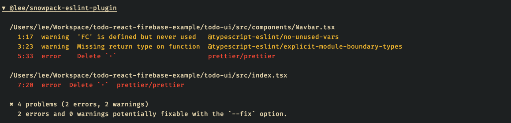

# @lee/snowpack-eslint-plugin

`@lee/snowpack-eslint-plugin` is a snowpack plugin to integrate [eslint](https://eslint.org/) into the snowpack develop
and build process. This plugin will simply run eslint as a subprocess. It also provides some terminal coloring for
errors and warnings via [chalk.js](https://github.com/chalk/chalk).



## Install

**Note, by default [eslint](https://www.npmjs.com/package/eslint) and 
[esw](https://www.npmjs.com/package/eslint-watch) are required, unless you change the lint commands (see below).**

With **yarn**
```shell
> yarn add @lee/snowpack-eslint-plugin
```

With **npm**
```shell
> npm install @lee/snowpack-elsint-plugin
```

## Usage:

Simple add it to your snowpack config:

```js
module.exports = {
  mount: {
    ...
  },
  plugins: [
    '@snowpack/plugin-react-refresh',
    '@snowpack/plugin-dotenv',
    '@snowpack/plugin-typescript',
    '@snowpack/plugin-postcss',
    '@lee/snowpack-eslint-plugin',
  ],
  routes: [
    ...
  ],
}
```

Or with some arguments:

```js
module.exports = {
  mount: {
    ...
  },
  plugins: [
    '@snowpack/plugin-react-refresh',
    '@snowpack/plugin-dotenv',
    '@snowpack/plugin-typescript',
    '@snowpack/plugin-postcss',
    [
      'snowpack-eslint-plugin',
      {
        name: 'lee'
        disableColoring: true,
      },
    ],
  ],
  routes: [
    ...
  ],
}
```

## Configuration

When configuring this plugin, it's important to understand the plugin basically does the same as the configuration below, with
a few extras (coloring in the terminal):
```js
plugins: [
  [
    '@snowpack/plugin-run-script',
    {
      cmd: 'eslint src --ext .ts,.tsx,.js,.jsx',
      watch: 'esw -w --clear src --ext .ts,.tsx,.js,.jsx',
    },
  ],
]
```


There are a few options you can use:

| option | default | description |
| ------ | ------- | ----------- |
| `eslintArgs` | `"src --ext .ts,.tsx,.js,.jsx"` | The arguments to provide to the eslint command |
| `eslintCommand` | `"eslint"` | The command to run for eslint |
| `eslintWatchArgs` | `"-w --clear src --ext .ts,.tsx,.js,.jsx"` | The arguments to provide to the eslint watch command |
| `eslintWatchCommand` | `"esw"` | The command to run for eslint when watching, i.e. in dev |
| `output` | `"dashboard"` | Can be either `dashboard` or `stream`. Changes the way linting output is logged in the terminal |
| `name` | `"@lee/snowpack-eslint-plugin"` | Changes the name of the plugin in that appears in the terminal |
| `disableColoring` | `false` | Disables color highlighting for eslint results |